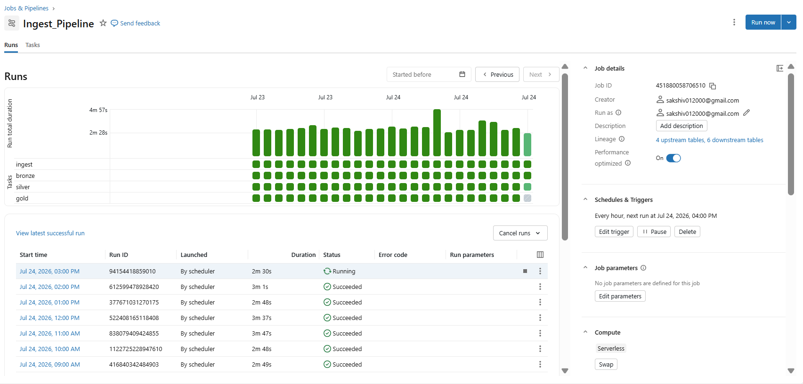

# Smart Transit Analytics Platform 🚌📊

**A real-time transit data pipeline built entirely on Databricks, from a live public GTFS-Realtime API through Unity Catalog, Medallion Architecture, MLflow, and AI/BI, built session by session as a hands-on learning project.**

---

## 📌 What This Project Is

A production-style Lakehouse pipeline ingesting **live public transit data** from Adelaide Metro's GTFS-Realtime API (Vehicle Positions + Trip Updates), processed through a governed **Medallion Architecture** (Bronze → Silver → Gold) inside **Unity Catalog**, with a trained and tracked **ML model** predicting vehicle ETA, surfaced through an **AI/BI Dashboard** and a **Genie** natural-language agent - all running unattended via three independently scheduled **Databricks Jobs**.

This wasn't built from a tutorial, it was built incrementally, one working piece at a time, including a real data bug found mid-project and fixed properly (Session 9), and a real Git/authentication issue diagnosed and resolved (Session 13).

## 📸 Preview

**AI/BI Dashboard**

**Automated Ingestion Pipeline (Databricks Jobs)**

More screenshots — Jobs, Catalog Explorer, Genie query history, GitHub integration — available in [`/Screenshots`](Screenshots/)

## 🧱 Databricks Concepts Used

| Concept | Where it shows up in this project |
|---|---|
| **Unity Catalog** | `transit_analytics` catalog → `landing/bronze/silver/gold` schemas |
| **Volumes** | `raw_gtfs` Volume — the landing zone for raw protobuf files |
| **Delta Lake** | Every Bronze/Silver/Gold table |
| **Medallion Architecture** | Bronze (raw) → Silver (clean/typed) → Gold (joined/aggregated) |
| **Auto Loader** | Incremental Bronze ingestion, checkpoint-proven (4→5 file test, no reprocessing) |
| **Lakeflow** | Underlying ingestion framework powering Auto Loader |
| **Databricks Jobs** | 3 independent scheduled Jobs (ingestion, ML retraining, dashboard refresh) |
| **Serverless SQL Warehouse** | Powers the Dashboard + Genie queries |
| **Photon** | Automatic vectorized execution engine on the Serverless Warehouse |
| **MLflow** | Experiment tracking, model comparison, signatures, tags |
| **AI/BI Dashboard** | 2-page dashboard on Gold tables, daily auto-refresh Job |
| **AI/BI Genie** | Natural language Q&A validated against all 3 Gold tables |
| **Lineage** | Auto-generated graph proving Gold → Dashboard/Genie/ML, zero manual tracking |
| **Permissions** | Unity Catalog GRANT/REVOKE model reviewed and documented |
| **Delta Sharing** | Cross-organization data sharing mechanism reviewed and documented |
| **Git Integration** | Databricks Git folders connected to GitHub (with a real auth issue diagnosed & fixed) |

## 📅 Session-by-Session Build Log

### Session 1 : Unity Catalog Foundation
Created the `transit_analytics` **catalog**, four **schemas** (`landing`, `bronze`, `silver`, `gold`), and a `raw_gtfs` **Volume** inside `landing` — the governed landing zone for raw files, before any code was written.

### Session 2 : Project Skeleton
Built a clean, GitHub-ready repo structure, a central `config.yaml` (single source of truth for catalog/schema names), and a reusable `config_loader.py` — so no script ever hardcodes a table name.

### Session 3 :  API Exploration
Investigated Adelaide Metro's GTFS-Realtime API directly: confirmed **no authentication required**, confirmed the response format is **Protocol Buffers (protobuf)** — not JSON — and decoded the first real records using Google's `gtfs-realtime-bindings` library to understand the true nested structure of Vehicle Positions and Trip Updates before writing any pipeline code.

### Session 4 : `GTFSClient`
Built a reusable, config-driven API client (`fetch_feed(feed_name)`) that fetches raw bytes for either feed — no duplicated request logic, no hardcoded URLs.

### Session 5 : `VolumeWriter`
Built an authenticated writer that uploads raw bytes into the Unity Catalog Volume, one timestamped file per poll, organized into per-feed subfolders — deliberately designed so Auto Loader (next session) would have new files to detect.

### Session 6 : Auto Loader → Bronze
Built `ingest_to_bronze(feed_name)` using **Auto Loader** (`cloudFiles` format, binary mode) to incrementally load raw files into Bronze Delta tables. **Proved incremental behavior concretely**: after ingesting 4 files, added a 5th, re-ran — row count went 4→5, not 8→10, confirming checkpoints correctly prevented reprocessing.

### Session 7 : Silver: Decode, Type, Clean
Wrote UDFs (`parse_vehicle_positions`, `parse_trip_updates`) to decode Bronze's raw binary using the same protobuf schema from Session 3, `explode()`-ing nested structures into flat rows. Converted raw Unix timestamps into proper `timestamp` type (correctly adjusted to Adelaide's timezone), removed invalid coordinates/negative speeds, and deduplicated — consolidated into a single-pass pipeline (no redundant writes).

### Session 8 : Gold: Join & Aggregate
Built two purpose-built Gold tables:
- **`vehicle_trip_features`** — joined Vehicle Positions + Trip Updates to calculate `seconds_to_next_stop`, a genuine ML target built from *both* feeds
- **`route_performance_summary`** — per-route aggregation (avg/min/max speed, reading count) for BI consumption

### Session 9 : ML with MLflow (including a real bug fix)
- Initially one-hot encoded `route_id` (58 sparse columns on ~100 rows) — caused negative R² across models. **Diagnosed as a real feature-engineering mistake**, fixed by using `avg_speed` (from `route_performance_summary`) as a single numeric feature instead.
- As the automated pipeline (Session 10) accumulated more data, **discovered a second, more serious bug**: a cross-day `trip_id` collision was producing 23-hour outlier values in the target variable. Diagnosed via `describe()` and outlier inspection, fixed properly at the Gold join (added `start_date` to the join key + a sanity cap), not patched around.
- **Compared 11 models** on the corrected data: Linear/Ridge/Lasso Regression, Decision Tree, Random Forest, Gradient Boosting, Extra Trees, AdaBoost, KNN, SVM, and MLP — all consistently scaled, all tracked as separate MLflow runs.
- **Tuned the top performer** (Extra Trees) via `GridSearchCV` with 5-fold cross-validation — final model: R²=0.125, MAE≈70s, with CV and test scores closely aligned (confirming a genuine, non-overfit improvement).
- Logged parameters, metrics, model signatures, and honest `data_limitation` tags on every run.

### Session 10 : Databricks Jobs (Automation)
Built two independently scheduled Jobs:
- **`Ingest_Pipeline`** — `ingest → bronze → silver → gold`, chained with explicit task dependencies, running **every 5 minutes**. Verified end-to-end (2m 44s), then confirmed real automation by watching Gold's row count grow unattended (103 → 370+ rows).
- **`ml_retraining_pipeline`** — a separate Job running `ml_experiment` **daily**, deliberately decoupled from the 5-minute ingestion cadence since model quality doesn't meaningfully change on 5-minute timescales.

### Session 11 : AI/BI Dashboard
Built a two-page **Transit Performance Dashboard**:
- **Route Performance** — bar chart of `avg_speed` per route, from `route_performance_summary`
- **ETA Predictions** — KPIs (avg actual vs. predicted speed) and a scatter plot, from a new `eta_predictions` Gold table

Extended `ml_experiment` to write actual-vs-predicted values into `eta_predictions` — the bridge connecting MLflow's model output to something a dashboard can actually visualize. Automated with a dedicated **`Transit_Dashboard_Run`** Job (task type: Dashboard), scheduled daily, including email snapshot delivery.

### Session 12 : AI/BI Genie
Created a **Genie Space** ("Transit Operations Genie") connected to all three Gold tables. Validated it against a range of questions — from simple lookups ("which route has the highest average speed?") to genuine multi-step reasoning ("which routes have the biggest gap between predicted and actual arrival time?") — confirming the Gold layer is well-structured enough for reliable natural-language querying.

### Session 13 : Connecting Databricks to GitHub (a real debugging story)
- Discovered an existing "Repos" folder was actually just a plain Workspace folder — not Git-connected at all.
- Created a genuine Git-linked folder, hit an OAuth failure, fell back to a Personal Access Token credential.
- Hit a platform limitation: Genie Space files can't be committed to Git folders at all.
- Commits *appeared* to succeed in Databricks (real commit hash shown) but **nothing reached GitHub** — root-caused to the Databricks GitHub App never being fully installed with write permissions on the account. Fixed by properly authorizing the app, then the push succeeded for real.

### Session 14 : Lineage
Reviewed Unity Catalog's **automatically generated lineage graph** on `route_performance_summary` — confirmed, with zero manual documentation, that this single Gold table correctly feeds the Dashboard, the Dashboard's refresh Job, the ML retraining pipeline, and the Genie agent — all tracked automatically from ordinary `spark.table()` / `saveAsTable()` calls.

### Session 15 : Permissions
Reviewed Unity Catalog's access control model (`GRANT`/`REVOKE`, principle of least privilege) and documented the intended access pattern for a real multi-user deployment (read-only Gold access for analysts, full access for data engineers).

### Session 16 : Delta Sharing
Reviewed Databricks' open cross-platform data sharing protocol — Shares, Recipients, and how external partners could query live Gold tables without data duplication or requiring a Databricks account.

### Session 17 : Photon
Confirmed the Serverless SQL Warehouse powering the Dashboard and Genie runs on **Photon** by design — Serverless compute always uses Photon's vectorized execution engine automatically, with no separate toggle needed.

## 🔮 Future Work

- Static GTFS schedule integration for true schedule-vs-actual delay calculation
- Sequence-based modeling (LSTM/GRU) once historical data volume genuinely justifies it
- Lakeflow Declarative Pipelines (DLT) refactor of Bronze/Silver/Gold
- Real-time model scoring (score latest data every 5 minutes, not just daily)
- Full multi-user Permissions and Delta Sharing demo in a team workspace
